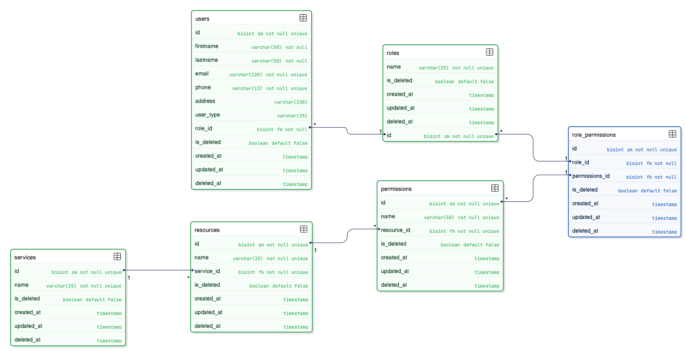

# Database Models for Microservices

## Overview

This repository contains the database models for the microservices architecture of the application. Each microservice has its own set of database entities, relationships, and constraints defined to ensure data integrity and efficient access.

---

## Entity-Relationship Diagrams

### 1. User-Auth Service
 

---

## License

This project is licensed under the [The Play Around License](LICENSE).

---