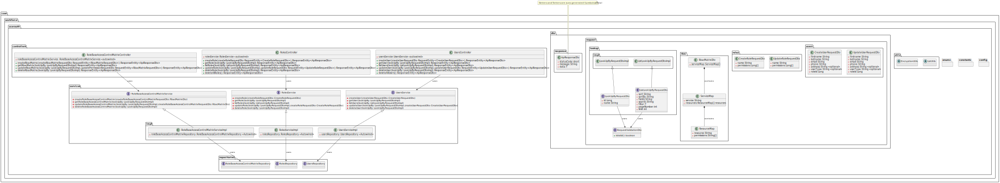

# User-Auth Microservice

## Overview

The **User-Auth** microservice is responsible for managing user accounts, authentication, and role-based access control. This service handles:

- User registration and login
- Role and permission assignment
- Token generation and validation

---

## Low-Level Design

Below is the low-level class diagram representing the core components and relationships within the `user-auth` service:

<div style="overflow-x: auto; padding: 2px;">
  
</div>

---

## Technologies Used

- **Java 17+**
- **Spring Boot**
- **Spring Security**
- **JWT (JSON Web Token)** [TODO]
- **Postgres**
- **Maven**

---

## Getting Started

### Prerequisites

Ensure the following are installed:

- Java 11+
- Maven
- Postgres

### Setup Instructions

1. Navigate to the `user-auth` directory:

   ```bash
   mvn clean install
   mvn spring-boot:run
